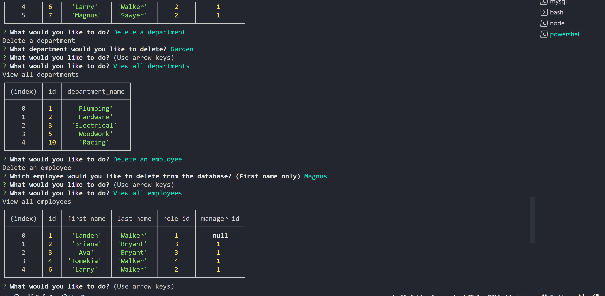

# Landen AutoReadMe Generator

## Title

Landen Employee Management System

# Table of Contents

- [GitHub](#github)
- [Description](#description)
- [Installation](#installation)
- [Usage](#usage)
- [License](#license)
- [How To Contribute](#howtocontribute)
- [Tests](#tests)
- [Screenshot](#screenshot)
- [Link](#link)

## GitHub

[Link](https://www.github.com/lwalker107)

## Email

landenwalker880@gmail.com

## Description

A management system created to handle databases containing departments, employees and roles. By using mySQL for
the databases and using Nodejs and Inquirer for the backend, the user is able to view, add, delete and update the
3 databases however they want.

## Installlation 

npm i

## Usage

You need node.js, mysql and inquirer installed into your computer env for it to work.

## License

MIT

## How to Contribute

You need to know my GitHub username, my email for questions and a working knowledge of Git.

## Tests

npm run tests

## Screenshot

## Link 

https://drive.google.com/file/d/1RqK-ZU_w13MFK6ILvQILrRfuzzgkoifP/view